# OpenSarToolkit v2.2.0

Preprocessing an S1 image with OpenSarToolkit OST.

> This software is licensed under the terms of the [Creative Commons Attribution 4.0 International](https://creativecommons.org/licenses/by/4.0/legalcode) license - SPDX short identifier: [CC-BY-4.0](https://spdx.org/licenses/CC-BY-4.0)
>
> 2026-03-10 - 2026-03-30T13:19:28.307 Copyright [Terradue Srl](mailto:info@terradue.com) - > [https://ror.org/0069cx113](https://ror.org/0069cx113)

## Project Team

### Authors

| Name | Email | Organization | Role | Identifier |
|------|-------|--------------|------|------------|
| Vollrath, Andreas | [andreas.vollrath@fao.org](mailto:andreas.vollrath@fao.org) | [Food and Agriculture Organization of the United Nations](https://ror.org/00pe0tf51) | []() | [https://github.com/BuddyVolly](https://github.com/BuddyVolly) |
| Lurcock, Pontus | [pontus.lurcock@brockmann-consult.de](mailto:pontus.lurcock@brockmann-consult.de) | [Brockmann Consult](https://ror.org/04r0k9g65) | []() | [https://orcid.org/0000-0001-6994-071X](https://orcid.org/0000-0001-6994-071X) |


### Contributors

| Name | Email | Organization | Role | Identifier |
|------|-------|--------------|------|------------|
| Vaccari, Simone | [simone.vaccari@terradue.com](mailto:simone.vaccari@terradue.com) | [Terradue Srl](https://ror.org/0069cx113) | [Researcher](http://purl.org/spar/datacite/Researcher) | [https://orcid.org/0000-0002-2757-4165](https://orcid.org/0000-0002-2757-4165) |


## DeveloperGuide

DeveloperGuide can be found on [https://terradue.github.io/eoap-open-sar-toolkit/](https://terradue.github.io/eoap-open-sar-toolkit/).


## Runtime environment

### Supported Operating Systems

- Linux
- MacOS X

### Requirements

- [https://cwltool.readthedocs.io/en/latest/](https://cwltool.readthedocs.io/en/latest/)
- [https://www.python.org/](https://www.python.org/)


## Software Source code

- Browsable version of the [source repository](https://github.com/Terradue/eoap-open-sar-toolkit.git);
- [Continuous integration](https://github.com/Terradue/eoap-open-sar-toolkit/actions) system used by the project;
- Issues, bugs, and feature requests should be submitted to the following [issue management](https://github.com/Terradue/eoap-open-sar-toolkit/issues) system for this project


---


## opensartoolkit

### CWL Class

[Workflow](https://www.commonwl.org/v1.2/Workflow.html#Workflow)

### Requirements

* [NetworkAccess](https://www.commonwl.org/v1.2/Workflow.html#NetworkAccess)
* [ScatterFeatureRequirement](https://www.commonwl.org/v1.2/Workflow.html#ScatterFeatureRequirement)
* [SubworkflowFeatureRequirement](https://www.commonwl.org/v1.2/Workflow.html#SubworkflowFeatureRequirement)
* [StepInputExpressionRequirement](https://www.commonwl.org/v1.2/Workflow.html#StepInputExpressionRequirement)
* [InlineJavascriptRequirement](https://www.commonwl.org/v1.2/Workflow.html#InlineJavascriptRequirement)
* [SchemaDefRequirement](https://www.commonwl.org/v1.2/Workflow.html#SchemaDefRequirement)

### Inputs

| Id | Type | Label | Doc |
|----|------|-------|-----|
| `resolution` | [int](https://www.commonwl.org/v1.2/Workflow.html#CWLType) | Resolution | Resolution in metres |
| `ard-type` | One of:<ul><li>[enum](https://www.commonwl.org/v1.2/Workflow.html#InputEnumSchema):<ul><li>`OST_GTC`</li><li>`OST-RTC`</li><li>`CEOS`</li><li>`Earth-Engine`</li></ul></li></ul> | ARD type | Type of analysis-ready data to produce |
| `with-speckle-filter` | One of:<ul><li>[enum](https://www.commonwl.org/v1.2/Workflow.html#InputEnumSchema):<ul><li>`APPLY-FILTER`</li><li>`NO-FILTER`</li></ul></li></ul> | Speckle filter | Whether to apply a speckle filter |
| `resampling-method` | One of:<ul><li>[enum](https://www.commonwl.org/v1.2/Workflow.html#InputEnumSchema):<ul><li>`BILINEAR_INTERPOLATION`</li><li>`BICUBIC_INTERPOLATION`</li></ul></li></ul> | Resampling method | Resampling method to use |
| `target_datetime` | [DateTime](https://raw.githubusercontent.com/eoap/schemas/main/string_format.yaml#DateTime):<ul><li>`value`: [string](https://www.commonwl.org/v1.2/Workflow.html#CWLType)</li></ul> | Target datetime | Target datetime in ISO 8601 format |
| `bbox` | [Polygon](https://raw.githubusercontent.com/eoap/schemas/main/geojson.yaml#Polygon):<ul><li>`type`: [enum](https://www.commonwl.org/v1.2/Workflow.html#CommandInputEnumSchema):<ul><li>`Polygon`</li></ul></li><li>`coordinates`: `array` of `array` of `array` of [double](https://www.commonwl.org/v1.2/Workflow.html#CWLType)</li><li>`bbox`: `array` of [double](https://www.commonwl.org/v1.2/Workflow.html#CWLType)</li></ul> | Area of interest | AOI polygon (bbox field will be used for STAC bbox) |


### Steps

| Id | Runs | Label | Doc |
|----|------|-------|-----|
| [build_search_request](#build_search_request) | `#build_search_request` | Build search_request and add datetime-interval | None |
| [discovery](#odata-client) | `#odata-client` | OData API discovery | Discover STAC items from a OData API endpoint based on a search request |
| [convert_search](#convert-search) | `#convert-search` | Convert Search | Convert Search results to get the item self hrefs |
| [s1_subworkflow](#s1_subworkflow) | `#s1_subworkflow` | Sub-workflow to process searched S1 data | Sub-workflow to process searched S1 data |


### Outputs

| Id | Type | Label | Doc |
|----|------|-------|-----|
| `output` | `array` of [Directory](https://www.commonwl.org/v1.2/Workflow.html#Directory) | None | None |


### OGC API - Processes

When `opensartoolkit` [Workflow](https://www.commonwl.org/v1.2/Workflow.html#Workflow) is exposed through [OGC API - Processes - Part 1: Core](https://docs.ogc.org/is/18-062r2/18-062r2.html), `inputs` and `outputs` fields below represent the interface of the [getProcessDescription](https://developer.ogc.org/api/processes/index.html#tag/ProcessDescription/operation/getProcessDescription) API. 


#### Inputs

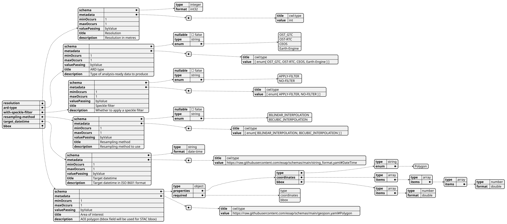

#### Outputs

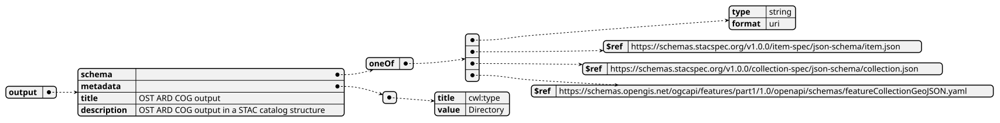


### UML Diagrams


#### Activity diagram

Learn more about the [Activity diagram](https://en.wikipedia.org/wiki/Activity_diagram) below.

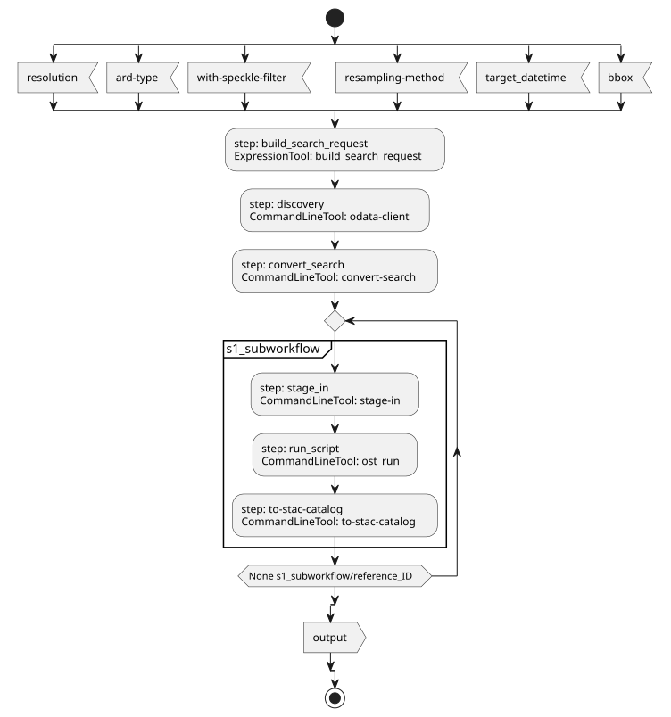

#### Component diagram

Learn more about the [Component diagram](https://en.wikipedia.org/wiki/Component_diagram) below.

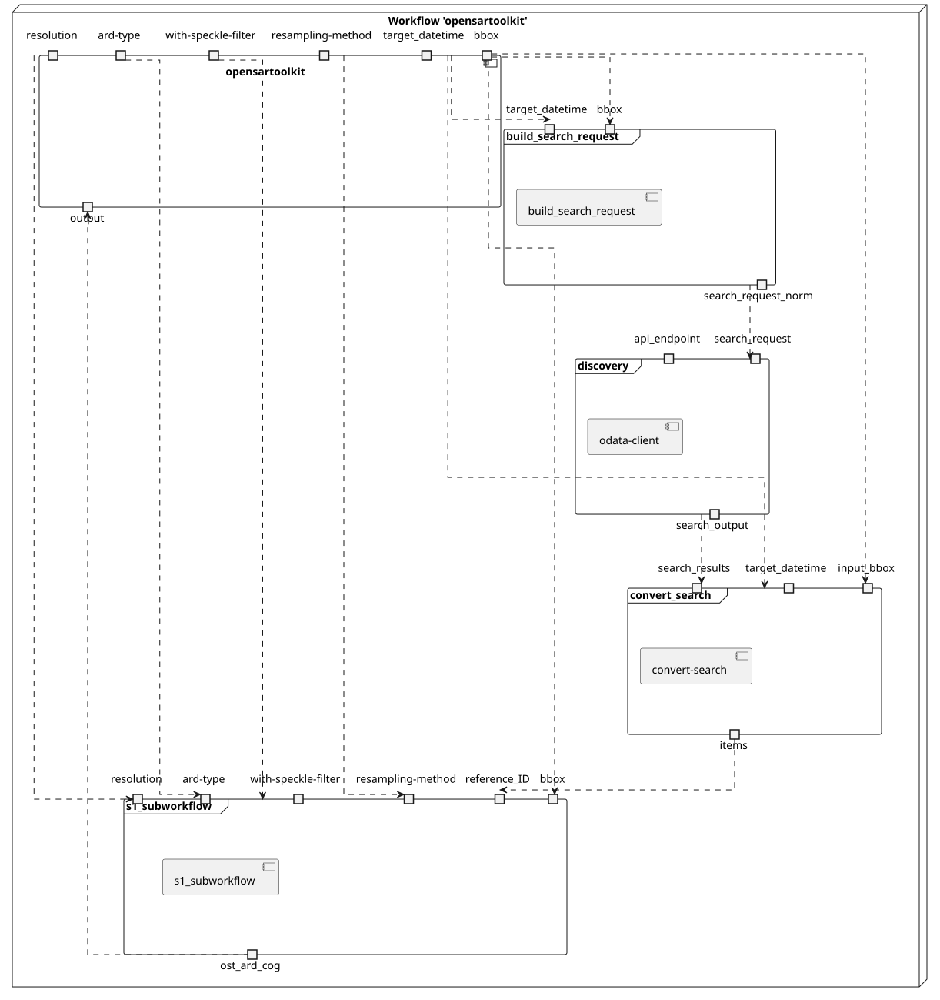

#### Class diagram

Learn more about the [Class diagram](https://en.wikipedia.org/wiki/Class_diagram) below.

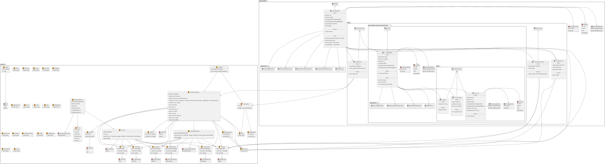

#### Sequence diagram

Learn more about the [Sequence diagram](https://en.wikipedia.org/wiki/Sequence_diagram) below.

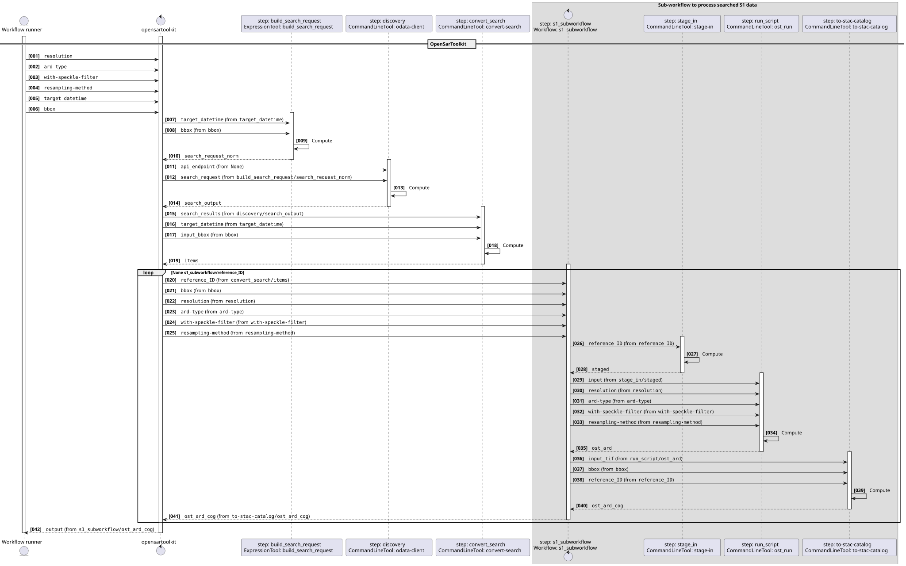

#### State diagram

Learn more about the [State diagram](https://en.wikipedia.org/wiki/State_diagram) below.

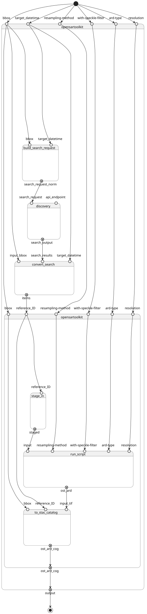


### Run in step

`build_search_request`


## build_search_request

### CWL Class

[ExpressionTool](https://www.commonwl.org/v1.2/Workflow.html#ExpressionTool)

### Inputs

| Id | Option | Type |
|----|------|-------|
| `target_datetime` | `--target_datetime` | [DateTime](https://raw.githubusercontent.com/eoap/schemas/main/string_format.yaml#DateTime):<ul><li>`value`: [string](https://www.commonwl.org/v1.2/Workflow.html#CWLType)</li></ul> |
| `bbox` | `--bbox` | [Polygon](https://raw.githubusercontent.com/eoap/schemas/main/geojson.yaml#Polygon):<ul><li>`type`: [enum](https://www.commonwl.org/v1.2/Workflow.html#CommandInputEnumSchema):<ul><li>`Polygon`</li></ul></li><li>`coordinates`: `array` of `array` of `array` of [double](https://www.commonwl.org/v1.2/Workflow.html#CWLType)</li><li>`bbox`: `array` of [double](https://www.commonwl.org/v1.2/Workflow.html#CWLType)</li></ul> |


### Run in step

`discovery`


## odata-client

### CWL Class

[CommandLineTool](https://www.commonwl.org/v1.2/CommandLineTool.html#CommandLineTool)

### Inputs

| Id | Option | Type |
|----|------|-------|
| `api_endpoint` | `--api_endpoint` | [APIEndpoint](https://raw.githubusercontent.com/eoap/schemas/main/experimental/api-endpoint.yaml#APIEndpoint):<ul><li>`url`: [URI](https://raw.githubusercontent.com/eoap/schemas/main/string_format.yaml#URI):<ul><li>`value`: [string](https://www.commonwl.org/v1.2/Workflow.html#CWLType)</li></ul></li><li>`headers`: One of:<ul><li>[null](https://www.commonwl.org/v1.2/Workflow.html#CWLType)</li><li>`array` of [KeyValuePair](https://raw.githubusercontent.com/eoap/schemas/main/experimental/api-endpoint.yaml#KeyValuePair):<ul><li>`key`: [string](https://www.commonwl.org/v1.2/Workflow.html#CWLType)</li><li>`value`: [string](https://www.commonwl.org/v1.2/Workflow.html#CWLType)</li></ul></li></ul></li></ul> |
| `search_request` | `--search_request` | [STACSearchSettings](https://raw.githubusercontent.com/eoap/schemas/main/experimental/discovery.yaml#STACSearchSettings):<ul><li>`bbox`: One of:<ul><li>[null](https://www.commonwl.org/v1.2/Workflow.html#CWLType)</li><li>`array` of [double](https://www.commonwl.org/v1.2/Workflow.html#CWLType)</li></ul></li><li>`datetime`: One of:<ul><li>[null](https://www.commonwl.org/v1.2/Workflow.html#CWLType)</li><li>[DateTime](https://raw.githubusercontent.com/eoap/schemas/main/string_format.yaml#DateTime):<ul><li>`value`: [string](https://www.commonwl.org/v1.2/Workflow.html#CWLType)</li></ul></li></ul></li><li>`datetime-interval`: One of:<ul><li>[null](https://www.commonwl.org/v1.2/Workflow.html#CWLType)</li><li>[DatetimeInterval](https://raw.githubusercontent.com/eoap/schemas/main/experimental/discovery.yaml#DatetimeInterval):<ul><li>`start`: [DateTime](https://raw.githubusercontent.com/eoap/schemas/main/string_format.yaml#DateTime):<ul><li>`value`: [string](https://www.commonwl.org/v1.2/Workflow.html#CWLType)</li></ul></li><li>`end`: [DateTime](https://raw.githubusercontent.com/eoap/schemas/main/string_format.yaml#DateTime):<ul><li>`value`: [string](https://www.commonwl.org/v1.2/Workflow.html#CWLType)</li></ul></li></ul></li></ul></li><li>`intersects`: One of:<ul><li>[null](https://www.commonwl.org/v1.2/Workflow.html#CWLType)</li><li>[Point](https://raw.githubusercontent.com/eoap/schemas/main/geojson.yaml#Point):<ul><li>`type`: [enum](https://www.commonwl.org/v1.2/Workflow.html#CommandInputEnumSchema):<ul><li>`Point`</li></ul></li><li>`coordinates`: `array` of [double](https://www.commonwl.org/v1.2/Workflow.html#CWLType)</li><li>`bbox`: `array` of [double](https://www.commonwl.org/v1.2/Workflow.html#CWLType)</li></ul></li><li>[MultiPoint](https://raw.githubusercontent.com/eoap/schemas/main/geojson.yaml#MultiPoint):<ul><li>`type`: [enum](https://www.commonwl.org/v1.2/Workflow.html#CommandInputEnumSchema):<ul><li>`MultiPoint`</li></ul></li><li>`coordinates`: `array` of `array` of [double](https://www.commonwl.org/v1.2/Workflow.html#CWLType)</li><li>`bbox`: `array` of [double](https://www.commonwl.org/v1.2/Workflow.html#CWLType)</li></ul></li><li>[LineString](https://raw.githubusercontent.com/eoap/schemas/main/geojson.yaml#LineString):<ul><li>`type`: [enum](https://www.commonwl.org/v1.2/Workflow.html#CommandInputEnumSchema):<ul><li>`LineString`</li></ul></li><li>`coordinates`: `array` of [double](https://www.commonwl.org/v1.2/Workflow.html#CWLType)</li><li>`bbox`: `array` of [double](https://www.commonwl.org/v1.2/Workflow.html#CWLType)</li></ul></li><li>[MultiLineString](https://raw.githubusercontent.com/eoap/schemas/main/geojson.yaml#MultiLineString):<ul><li>`type`: [enum](https://www.commonwl.org/v1.2/Workflow.html#CommandInputEnumSchema):<ul><li>`MultiLineString`</li></ul></li><li>`coordinates`: `array` of `array` of `array` of [double](https://www.commonwl.org/v1.2/Workflow.html#CWLType)</li><li>`bbox`: `array` of [double](https://www.commonwl.org/v1.2/Workflow.html#CWLType)</li></ul></li><li>[Polygon](https://raw.githubusercontent.com/eoap/schemas/main/geojson.yaml#Polygon):<ul><li>`type`: [enum](https://www.commonwl.org/v1.2/Workflow.html#CommandInputEnumSchema):<ul><li>`Polygon`</li></ul></li><li>`coordinates`: `array` of `array` of `array` of [double](https://www.commonwl.org/v1.2/Workflow.html#CWLType)</li><li>`bbox`: `array` of [double](https://www.commonwl.org/v1.2/Workflow.html#CWLType)</li></ul></li><li>[MultiPolygon](https://raw.githubusercontent.com/eoap/schemas/main/geojson.yaml#MultiPolygon):<ul><li>`type`: [enum](https://www.commonwl.org/v1.2/Workflow.html#CommandInputEnumSchema):<ul><li>`MultiPolygon`</li></ul></li><li>`coordinates`: `array` of `array` of `array` of `array` of [double](https://www.commonwl.org/v1.2/Workflow.html#CWLType)</li><li>`bbox`: `array` of [double](https://www.commonwl.org/v1.2/Workflow.html#CWLType)</li></ul></li><li>[GeometryCollection](https://raw.githubusercontent.com/eoap/schemas/main/geojson.yaml#GeometryCollection):<ul><li>`type`: [enum](https://www.commonwl.org/v1.2/Workflow.html#CommandInputEnumSchema):<ul><li>`GeometryCollection`</li></ul></li><li>`geometries`: `array` of One of:<ul><li>[Point](https://raw.githubusercontent.com/eoap/schemas/main/geojson.yaml#Point):<ul><li>`type`: [enum](https://www.commonwl.org/v1.2/Workflow.html#CommandInputEnumSchema):<ul><li>`Point`</li></ul></li><li>`coordinates`: `array` of [double](https://www.commonwl.org/v1.2/Workflow.html#CWLType)</li><li>`bbox`: `array` of [double](https://www.commonwl.org/v1.2/Workflow.html#CWLType)</li></ul></li><li>[LineString](https://raw.githubusercontent.com/eoap/schemas/main/geojson.yaml#LineString):<ul><li>`type`: [enum](https://www.commonwl.org/v1.2/Workflow.html#CommandInputEnumSchema):<ul><li>`LineString`</li></ul></li><li>`coordinates`: `array` of [double](https://www.commonwl.org/v1.2/Workflow.html#CWLType)</li><li>`bbox`: `array` of [double](https://www.commonwl.org/v1.2/Workflow.html#CWLType)</li></ul></li><li>[Polygon](https://raw.githubusercontent.com/eoap/schemas/main/geojson.yaml#Polygon):<ul><li>`type`: [enum](https://www.commonwl.org/v1.2/Workflow.html#CommandInputEnumSchema):<ul><li>`Polygon`</li></ul></li><li>`coordinates`: `array` of `array` of `array` of [double](https://www.commonwl.org/v1.2/Workflow.html#CWLType)</li><li>`bbox`: `array` of [double](https://www.commonwl.org/v1.2/Workflow.html#CWLType)</li></ul></li><li>[MultiPoint](https://raw.githubusercontent.com/eoap/schemas/main/geojson.yaml#MultiPoint):<ul><li>`type`: [enum](https://www.commonwl.org/v1.2/Workflow.html#CommandInputEnumSchema):<ul><li>`MultiPoint`</li></ul></li><li>`coordinates`: `array` of `array` of [double](https://www.commonwl.org/v1.2/Workflow.html#CWLType)</li><li>`bbox`: `array` of [double](https://www.commonwl.org/v1.2/Workflow.html#CWLType)</li></ul></li><li>[MultiLineString](https://raw.githubusercontent.com/eoap/schemas/main/geojson.yaml#MultiLineString):<ul><li>`type`: [enum](https://www.commonwl.org/v1.2/Workflow.html#CommandInputEnumSchema):<ul><li>`MultiLineString`</li></ul></li><li>`coordinates`: `array` of `array` of `array` of [double](https://www.commonwl.org/v1.2/Workflow.html#CWLType)</li><li>`bbox`: `array` of [double](https://www.commonwl.org/v1.2/Workflow.html#CWLType)</li></ul></li><li>[MultiPolygon](https://raw.githubusercontent.com/eoap/schemas/main/geojson.yaml#MultiPolygon):<ul><li>`type`: [enum](https://www.commonwl.org/v1.2/Workflow.html#CommandInputEnumSchema):<ul><li>`MultiPolygon`</li></ul></li><li>`coordinates`: `array` of `array` of `array` of `array` of [double](https://www.commonwl.org/v1.2/Workflow.html#CWLType)</li><li>`bbox`: `array` of [double](https://www.commonwl.org/v1.2/Workflow.html#CWLType)</li></ul></li></ul></li><li>`bbox`: `array` of [double](https://www.commonwl.org/v1.2/Workflow.html#CWLType)</li></ul></li></ul></li><li>`collections`: One of:<ul><li>[null](https://www.commonwl.org/v1.2/Workflow.html#CWLType)</li><li>`array` of [string](https://www.commonwl.org/v1.2/Workflow.html#CWLType)</li></ul></li><li>`ids`: One of:<ul><li>[null](https://www.commonwl.org/v1.2/Workflow.html#CWLType)</li><li>`array` of [string](https://www.commonwl.org/v1.2/Workflow.html#CWLType)</li></ul></li><li>`limit`: One of:<ul><li>[null](https://www.commonwl.org/v1.2/Workflow.html#CWLType)</li><li>[int](https://www.commonwl.org/v1.2/Workflow.html#CWLType)</li></ul></li><li>`max-items`: One of:<ul><li>[null](https://www.commonwl.org/v1.2/Workflow.html#CWLType)</li><li>[int](https://www.commonwl.org/v1.2/Workflow.html#CWLType)</li></ul></li><li>`fields`: One of:<ul><li>[null](https://www.commonwl.org/v1.2/Workflow.html#CWLType)</li><li>[Fields](https://raw.githubusercontent.com/eoap/schemas/main/experimental/discovery.yaml#Fields):<ul><li>`include`: One of:<ul><li>[null](https://www.commonwl.org/v1.2/Workflow.html#CWLType)</li><li>`array` of [string](https://www.commonwl.org/v1.2/Workflow.html#CWLType)</li></ul></li><li>`exclude`: One of:<ul><li>[null](https://www.commonwl.org/v1.2/Workflow.html#CWLType)</li><li>`array` of [string](https://www.commonwl.org/v1.2/Workflow.html#CWLType)</li></ul></li></ul></li></ul></li><li>`filter`: One of:<ul><li>[null](https://www.commonwl.org/v1.2/Workflow.html#CWLType)</li><li>[Any](https://www.commonwl.org/v1.2/Workflow.html#Any)</li></ul></li><li>`filter-lang`: One of:<ul><li>[null](https://www.commonwl.org/v1.2/Workflow.html#CWLType)</li><li>[enum](https://www.commonwl.org/v1.2/Workflow.html#CommandInputEnumSchema):<ul><li>`cql2-text`</li><li>`cql2-json`</li></ul></li></ul></li><li>`filter-crs`: One of:<ul><li>[null](https://www.commonwl.org/v1.2/Workflow.html#CWLType)</li><li>`array` of [URI](https://raw.githubusercontent.com/eoap/schemas/main/string_format.yaml#URI):<ul><li>`value`: [string](https://www.commonwl.org/v1.2/Workflow.html#CWLType)</li></ul></li></ul></li><li>`sortby`: One of:<ul><li>[null](https://www.commonwl.org/v1.2/Workflow.html#CWLType)</li><li>`array` of [SortBy](https://raw.githubusercontent.com/eoap/schemas/main/experimental/discovery.yaml#SortBy):<ul><li>`field`: [string](https://www.commonwl.org/v1.2/Workflow.html#CWLType)</li><li>`direction`: [enum](https://www.commonwl.org/v1.2/Workflow.html#CommandInputEnumSchema):<ul><li>`asc`</li><li>`desc`</li></ul></li></ul></li></ul></li></ul> |

### Execution usage example:

```
odata-client search $(inputs.api_endpoint.url.value) ${ const args = []; const collections = inputs.search_request.collections; args.push('--collections', collections.join(",")); return args; } ${ const args = []; const bbox = inputs.search_request?.bbox; if (Array.isArray(bbox) && bbox.length >= 4) { args.push('--bbox', ...bbox.map(String)); } return args; } ${ const args = []; const limit = inputs.search_request?.limit; args.push("--limit", (limit ?? 10).toString()); return args; } ${ const maxItems = inputs.search_request?.['max-items']; return ['--max-items', (maxItems ?? 20).toString()]; } ${ const args = []; const filter = inputs.search_request?.filter; const filterLang = inputs.search_request?.['filter-lang']; if (filterLang) { args.push('--filter-lang', filterLang); } if (filter) { args.push('--filter', JSON.stringify(filter)); } return args; } ${ const datetime = inputs.search_request?.datetime; const datetimeInterval = inputs.search_request?.datetime_interval; if (datetime) { return ['--datetime', datetime]; } else if (datetimeInterval) { const start = datetimeInterval.start?.value || '..'; const end = datetimeInterval.end?.value || '..'; return ['--datetime', `${start}/${end}`]; } return []; } ${ const ids = inputs.search_request?.ids; const args = []; if (Array.isArray(ids) && ids.length > 0) { args.push('--ids', ...ids.map(String)); } return args; } ${ const intersects = inputs.search_request?.intersects; if (intersects) { return ['--intersects', JSON.stringify(intersects)]; } return []; } --save discovery-output.json \
--api_endpoint <API_ENDPOINT> \
--search_request <SEARCH_REQUEST>
```

### Run in step

`convert_search`


## convert-search

### CWL Class

[CommandLineTool](https://www.commonwl.org/v1.2/CommandLineTool.html#CommandLineTool)

### Inputs

| Id | Option | Type |
|----|------|-------|
| `target_datetime` | `--target-datetime` | [DateTime](https://raw.githubusercontent.com/eoap/schemas/main/string_format.yaml#DateTime):<ul><li>`value`: [string](https://www.commonwl.org/v1.2/Workflow.html#CWLType)</li></ul> |
| `search_results` | `--search-results` | [File](https://www.commonwl.org/v1.2/Workflow.html#File) |
| `input_bbox` | `--input-bbox` | [Polygon](https://raw.githubusercontent.com/eoap/schemas/main/geojson.yaml#Polygon):<ul><li>`type`: [enum](https://www.commonwl.org/v1.2/Workflow.html#CommandInputEnumSchema):<ul><li>`Polygon`</li></ul></li><li>`coordinates`: `array` of `array` of `array` of [double](https://www.commonwl.org/v1.2/Workflow.html#CWLType)</li><li>`bbox`: `array` of [double](https://www.commonwl.org/v1.2/Workflow.html#CWLType)</li></ul> |

### Execution usage example:

```
convert-search \
--target-datetime <TARGET_DATETIME> \
--search-results <SEARCH_RESULTS> \
--input-bbox <INPUT_BBOX>
```

### Run in step

`s1_subworkflow`


## s1_subworkflow

### CWL Class

[Workflow](https://www.commonwl.org/v1.2/Workflow.html#Workflow)

### Requirements

* [NetworkAccess](https://www.commonwl.org/v1.2/Workflow.html#NetworkAccess)
* [InlineJavascriptRequirement](https://www.commonwl.org/v1.2/Workflow.html#InlineJavascriptRequirement)
* [StepInputExpressionRequirement](https://www.commonwl.org/v1.2/Workflow.html#StepInputExpressionRequirement)
* [SchemaDefRequirement](https://www.commonwl.org/v1.2/Workflow.html#SchemaDefRequirement)

### Inputs

| Id | Type | Label | Doc |
|----|------|-------|-----|
| `reference_ID` | [string](https://www.commonwl.org/v1.2/Workflow.html#CWLType) | Product reference ID | None |
| `bbox` | One of:<ul><li>[null](https://www.commonwl.org/v1.2/Workflow.html#CWLType)</li><li>`array` of [double](https://www.commonwl.org/v1.2/Workflow.html#CWLType)</li></ul> | Bounding Box | Bounding box [minx, miny, maxx, maxy] in the raster CRS |
| `resolution` | [int](https://www.commonwl.org/v1.2/Workflow.html#CWLType) | Resolution | Resolution in metres |
| `ard-type` | One of:<ul><li>[enum](https://www.commonwl.org/v1.2/Workflow.html#InputEnumSchema):<ul><li>`OST_GTC`</li><li>`OST-RTC`</li><li>`CEOS`</li><li>`Earth-Engine`</li></ul></li></ul> | ARD type | Type of analysis-ready data to produce |
| `with-speckle-filter` | One of:<ul><li>[enum](https://www.commonwl.org/v1.2/Workflow.html#InputEnumSchema):<ul><li>`APPLY-FILTER`</li><li>`NO-FILTER`</li></ul></li></ul> | Speckle filter | Whether to apply a speckle filter |
| `resampling-method` | One of:<ul><li>[enum](https://www.commonwl.org/v1.2/Workflow.html#InputEnumSchema):<ul><li>`BILINEAR_INTERPOLATION`</li><li>`BICUBIC_INTERPOLATION`</li></ul></li></ul> | Resampling method | Resampling method to use |


### Steps

| Id | Runs | Label | Doc |
|----|------|-------|-----|
| [stage_in](#stage-in) | `#stage-in` | Stage-in S1 data | Stage-in S1 data with Arvesto |
| [run_script](#ost_run) | `#ost_run` | None | None |
| [to-stac-catalog](#to-stac-catalog) | `#to-stac-catalog` | None | None |


### Outputs

| Id | Type | Label | Doc |
|----|------|-------|-----|
| `ost_ard_cog` | [Directory](https://www.commonwl.org/v1.2/Workflow.html#Directory) | OST ARD COG output | OST ARD COG output in a STAC catalog structure |


### OGC API - Processes

When `s1_subworkflow` [Workflow](https://www.commonwl.org/v1.2/Workflow.html#Workflow) is exposed through [OGC API - Processes - Part 1: Core](https://docs.ogc.org/is/18-062r2/18-062r2.html), `inputs` and `outputs` fields below represent the interface of the [getProcessDescription](https://developer.ogc.org/api/processes/index.html#tag/ProcessDescription/operation/getProcessDescription) API. 


#### Inputs

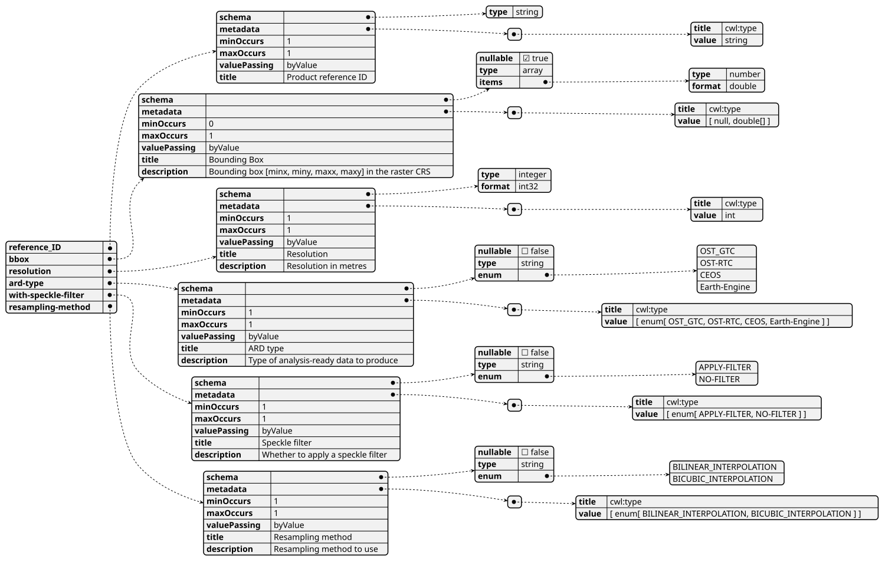

#### Outputs

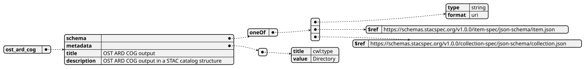


### UML Diagrams


#### Activity diagram

Learn more about the [Activity diagram](https://en.wikipedia.org/wiki/Activity_diagram) below.

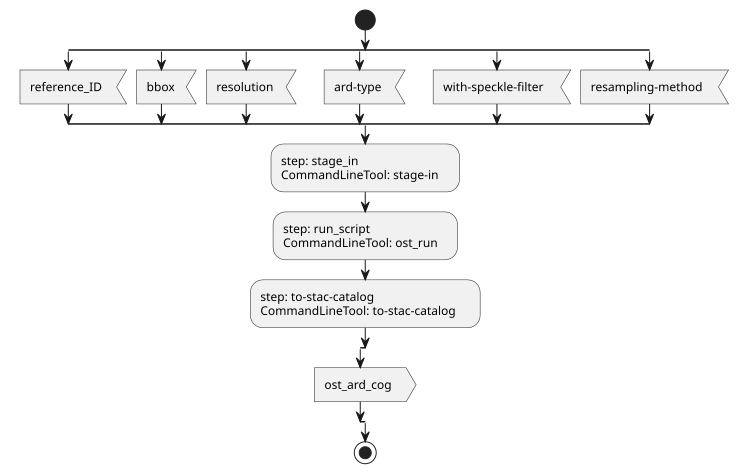

#### Component diagram

Learn more about the [Component diagram](https://en.wikipedia.org/wiki/Component_diagram) below.

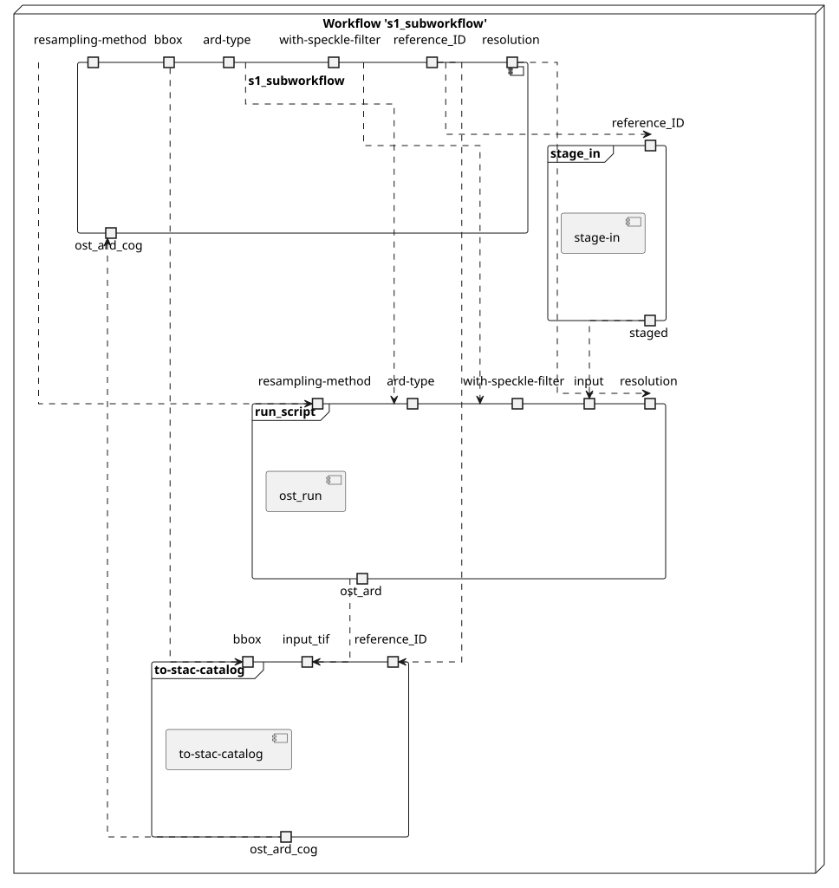

#### Class diagram

Learn more about the [Class diagram](https://en.wikipedia.org/wiki/Class_diagram) below.

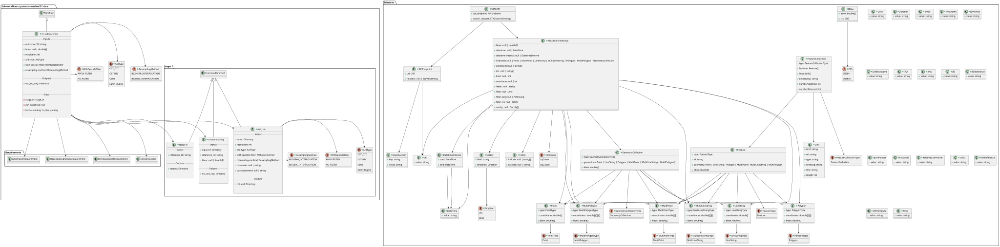

#### Sequence diagram

Learn more about the [Sequence diagram](https://en.wikipedia.org/wiki/Sequence_diagram) below.

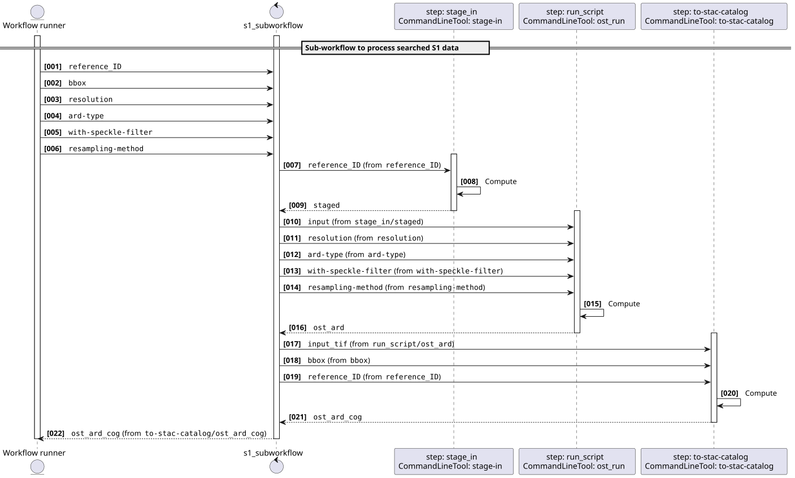

#### State diagram

Learn more about the [State diagram](https://en.wikipedia.org/wiki/State_diagram) below.

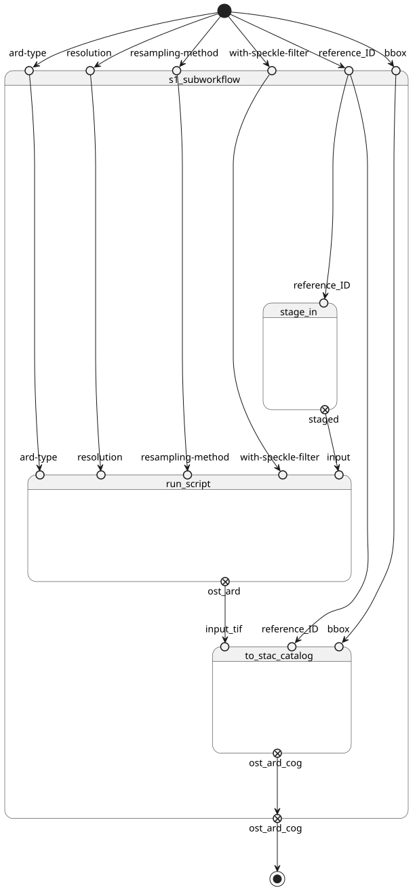


### Run in step

`stage_in`


## stage-in

### CWL Class

[CommandLineTool](https://www.commonwl.org/v1.2/CommandLineTool.html#CommandLineTool)

### Inputs

| Id | Option | Type |
|----|------|-------|
| `reference_ID` | `--reference_ID` | [string](https://www.commonwl.org/v1.2/Workflow.html#CWLType) |

### Execution usage example:

```
/bin/bash arvesto.sh \
--reference_ID <REFERENCE_ID>
```

### Run in step

`run_script`


## ost_run

### CWL Class

[CommandLineTool](https://www.commonwl.org/v1.2/CommandLineTool.html#CommandLineTool)

### Inputs

| Id | Option | Type |
|----|------|-------|
| `input` | `--input` | [Directory](https://www.commonwl.org/v1.2/Workflow.html#Directory) |
| `resolution` | `--resolution` | [int](https://www.commonwl.org/v1.2/Workflow.html#CWLType) |
| `ard-type` | `--ard-type` | One of:<ul><li>[enum](https://www.commonwl.org/v1.2/Workflow.html#CommandInputEnumSchema):<ul><li>`OST_GTC`</li><li>`OST-RTC`</li><li>`CEOS`</li><li>`Earth-Engine`</li></ul></li></ul> |
| `with-speckle-filter` | `--with-speckle-filter` | One of:<ul><li>[enum](https://www.commonwl.org/v1.2/Workflow.html#CommandInputEnumSchema):<ul><li>`APPLY-FILTER`</li><li>`NO-FILTER`</li></ul></li></ul> |
| `resampling-method` | `--resampling-method` | One of:<ul><li>[enum](https://www.commonwl.org/v1.2/Workflow.html#CommandInputEnumSchema):<ul><li>`BILINEAR_INTERPOLATION`</li><li>`BICUBIC_INTERPOLATION`</li></ul></li></ul> |
| `cdse-user` | `--cdse-user` | One of:<ul><li>[null](https://www.commonwl.org/v1.2/Workflow.html#CWLType)</li><li>[string](https://www.commonwl.org/v1.2/Workflow.html#CWLType)</li></ul> |
| `cdse-password` | `--cdse-password` | One of:<ul><li>[null](https://www.commonwl.org/v1.2/Workflow.html#CWLType)</li><li>[string](https://www.commonwl.org/v1.2/Workflow.html#CWLType)</li></ul> |

### Execution usage example:

```
/bin/bash run_me.sh --wipe-cwd \
--input <INPUT> \
--resolution <RESOLUTION> \
--ard-type <ARD-TYPE> \
--with-speckle-filter <WITH-SPECKLE-FILTER> \
--resampling-method <RESAMPLING-METHOD> \
(--cdse-user <CDSE-USER>) \
(--cdse-password <CDSE-PASSWORD>)
```

### Run in step

`to-stac-catalog`


## to-stac-catalog

### CWL Class

[CommandLineTool](https://www.commonwl.org/v1.2/CommandLineTool.html#CommandLineTool)

### Inputs

| Id | Option | Type |
|----|------|-------|
| `input_tif` | `--input-tif` | [Directory](https://www.commonwl.org/v1.2/Workflow.html#Directory) |
| `reference_ID` | `--reference-id` | [string](https://www.commonwl.org/v1.2/Workflow.html#CWLType) |
| `bbox` | `--bbox` | One of:<ul><li>[null](https://www.commonwl.org/v1.2/Workflow.html#CWLType)</li><li>`array` of [double](https://www.commonwl.org/v1.2/Workflow.html#CWLType)</li></ul> |

### Execution usage example:

```
stac-catalog \
--input-tif <INPUT_TIF> \
--reference-id <REFERENCE_ID> \
(--bbox <BBOX>)
```


